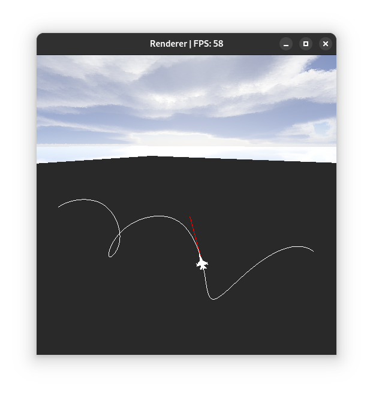
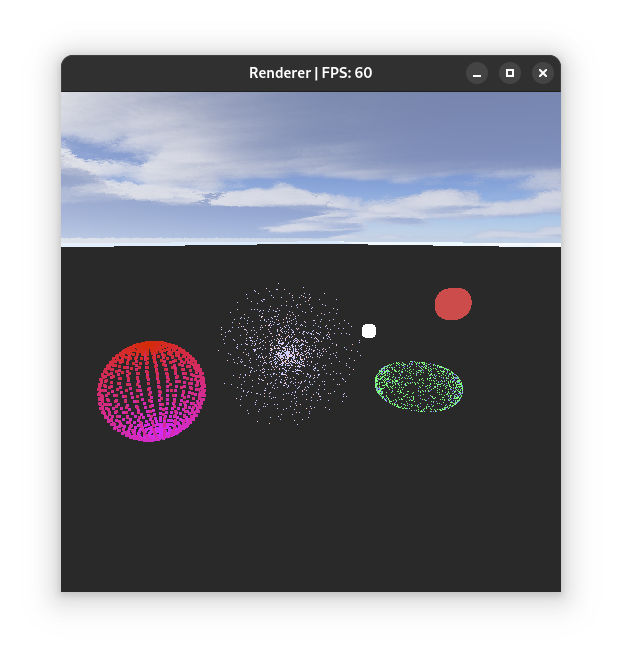
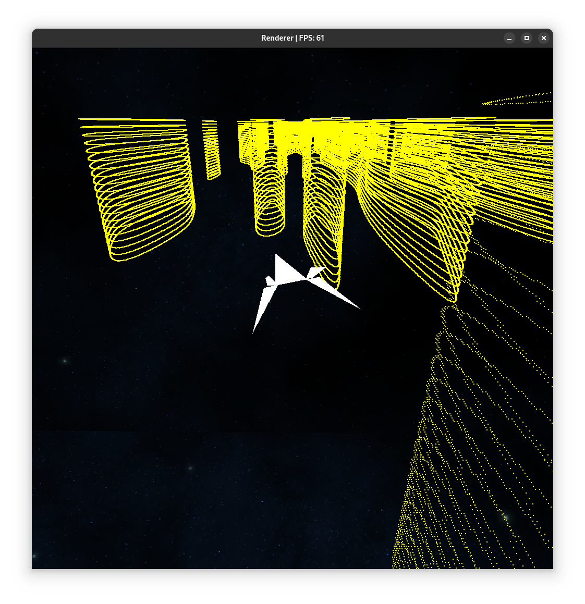

# Laboratory Exercises for "Computer Animation"

This repository contains solutions to laboratory exercises for the course "Computer Animation" in the graduate program at the Faculty of Electrical Engineering and Computing, University of Zagreb.

The repository includes solutions for three laboratory exercises:
1. B-Splines
2. Particle Systems
3. Arbitrary Topic - Demonstration Project

## 1. Exercise - B-Splines
The goal of this exercise is to demonstrate the use of B-Splines for animating the trajectory of an object over time, as well as animating its rotation along the curve.  
A 3rd-degree B-Spline with C2 continuity (≥ C1) is used.

To run this demonstration, execute the command:  
`./run.sh bspline`

A blank world will open with a predefined B-Spline in the shape of a helix.  
Pressing the **P** key will animate a jet model along the curve over 8 seconds.  
Pressing the **C** key allows adding points to a secondary B-Spline. Once there are more than 4 points, pressing the **P** key will animate the observer's camera along that curve, similar to the jet animation.

Movement is possible using the WASD keys, Space, Shift, and Control.

<figure>
  
  <figcaption>Scene with B-Spline</figcaption>
</figure>

## 2. Exercise - Particle Systems
The goal of this exercise is to implement a simple particle system.  
In this solution, it is implemented in software as point clouds controlled by lifecycle functions, rendered using OpenGL's **GL_POINTS** primitives.  
This approach provides great flexibility but limited ease of use and performance.  
(Planned future improvement: implement support for particle systems using Compute Shaders.)

To run the demonstration, execute the command:  
`./run.sh particles`

After starting, several particle systems will be displayed, animated over time. Each system showcases different features of animated particles (e.g., color and speed changes over time, particle size changes, looped animations, gravity effects, etc.).  
Pressing the **N** key generates a new particle set affected by gravity, which disappears after a few seconds.

Movement is possible using the WASD keys, Space, Shift, and Control.

<figure>
  
  <figcaption>Scene with Particle Systems</figcaption>
</figure>

## 3. Exercise - Demonstration Project
The topic of this exercise is arbitrary, with the goal of showcasing animation techniques in a practical example.

In this solution, the project is implemented as a game where the player controls a spaceship that must navigate through canyons without hitting the walls.  
The player has lateral and vertical control over the ship, which automatically moves forward at an increasing speed.

Canyons are procedurally generated using Perlin noise in segments. Over time, the canyons become narrower to increase difficulty.  
Incomplete walls at canyon density transitions are removed.  
The terrain is divided into fixed-size segments, which are loaded or unloaded as needed.  
Segment generation is multithreaded using a thread pool.  
Collision detection approximates the player's ship with an axis-aligned bounding box for simplicity.

Basic animations are implemented for game loading and collision events.  
When the ship's speed changes, the camera position adjusts slightly based on interpolated speed.

The spaceship can be controlled via keyboard or controller.  
On the keyboard, use arrow keys to steer, and Shift/Control to slightly accelerate or decelerate.  
On a controller, use the left analog stick to steer and LT/RT to adjust speed.  
To restart the game, press **R** on the keyboard or **Y** on the controller (button may vary depending on the controller).  
Pressing **SHIFT/PAUSE** opens a debug menu where collision can be disabled, ship speed adjusted, and the camera freed from the ship's model.

To run the demonstration, execute the command:  
`./run.sh game`

<figure>
  
  <figcaption>Scene with the Game</figcaption>
</figure>

## Technologies
The program solutions are implemented in C++ and OpenGL.
