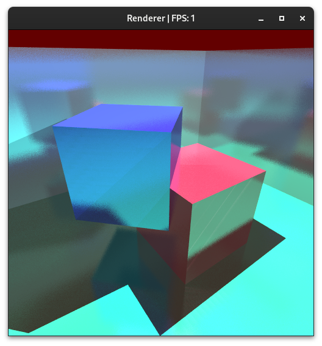

# RT Renderer

**Za hrvatsku verziju pogledajte [ovdje](README.md).**

A renderer with the capability to render using software-implemented ray tracing techniques and Monte Carlo path tracing.

**This application was developed as part of the final project for the undergraduate study at the Faculty of Electrical Engineering and Computing, University of Zagreb on the topic "Ray Tracing and Path Tracing".**

<figure>
  
  <figcaption>Example of an image rendered using path tracing</figcaption>
</figure>

## Technologies
The renderer is written in C++ and OpenGL.

## Running
Run `run.sh`.

## Usage Instructions
Upon startup, the renderer will run in rasterizer mode (Phong shading, shadow maps disabled).
You can move around the predefined scene.

To start rendering using ray tracing, press the "2" key.
The image will be displayed on the screen once the rendering is complete.

You can return to rasterizer mode by pressing the "1" key.
To start rendering using path tracing, press the "3" key,
this will perform one iteration of path tracing.

Other features:
- Automatic rendering and Monte Carlo integration can be enabled by pressing the "E" key.
- Increase rendering depth by pressing the up or down arrow keys.
- Increase or decrease the reflection coefficient by pressing the left or right arrow keys.
- Change the surface roughness by pressing the page up or page down keys (applies only to the path tracing algorithm).
