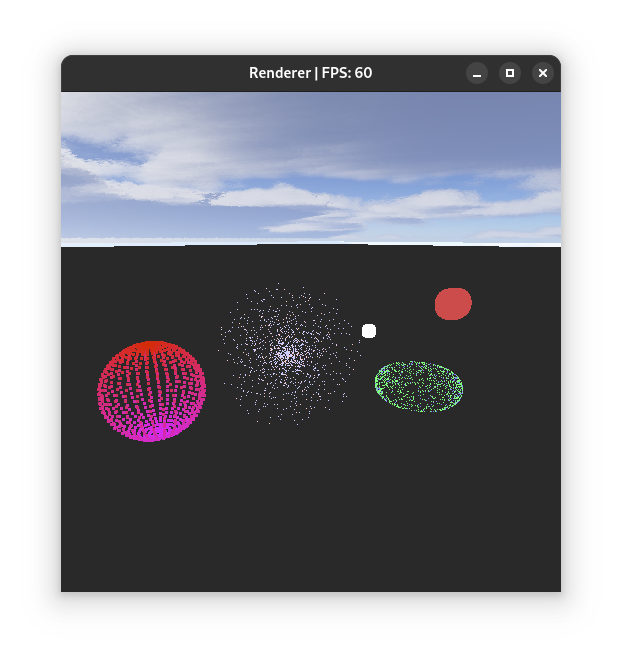
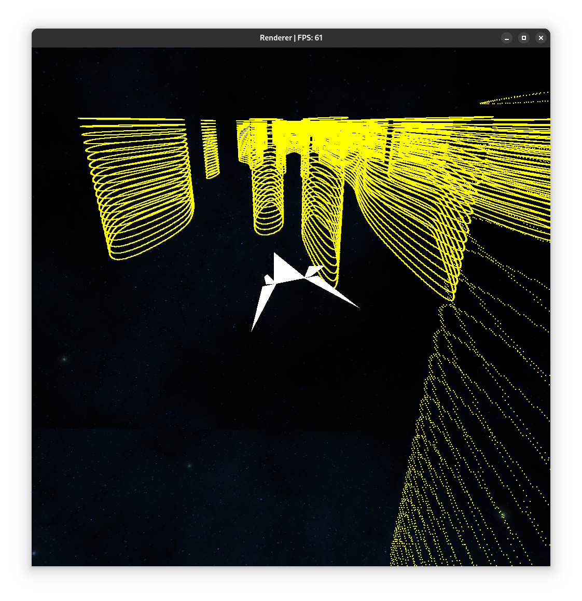

**To view this file in English, go [here](README.en.md).**

Ovaj repozitorij sadrži rješenja zadataka iz laboratorijskih vježbi iz kolegija
"Računalna animacija" na diplomskom studiju Fakulteta elektrotehnike i računarstva, Sveučilište u Zagrebu.

Nalaze se rješenja trojih laboratorijskih vježbi:
1. B-Krivulje
2. Čestični sustavi
3. Proizvoljna tema - demonstracijska projekt

## 1. vježba - B krivulje
Cilj ovog labosa je demonstrirati korištenje B-krivulja (engl. B-spline) za animiranje putanje objekta kroz vrijeme s puta,
kao i animiranje rotacije objekta u smjeru krivulje.
Korištena je B-krivulja stupnja 3 koja je kontinuiteta C2 (>= C1).

Za pokretanje ove demonstracije potrebno je izvršiti naredbu:  
`./run.sh bspline`

Pokrenut će se prazan svijet s predefiniranom b-krivuljom u obliku zavojnice.
Pritiskom na tipku P, model mlažnjaka će biti animiran po krivulji tijekom 8 sekundi.
Pritiskom na tipku C, dodajemo točke sekundarnoj B-kruvlji.
Nakon što imamo više od 4 točke, pritiskom na tipku P će se kamera promatrača animirati po
toj krivulji, slično kao i mlažnjak.

Moguće se pokretati tipkama WASD, Space, Shift i Control.

<figure>
  
  <figcaption>Izgled scene s B-krivuljom</figcaption>
</figure>

## 2. vježba - Čestični sustav
Cilj ovog labosa je implentirati jednostavan čestični sustav (engl. Particle System).
U ovom rješenju je on implementiran softverski kao oblaci točaka (engl. Point Cloud) koji se
kontroliraju pomoću lifecycle funkcija, renderiraju se pomoću OpenGL GL_POINTS primitiva.  
Ovaj pristup daje veliku fleksibilnost, ali ograničenu jednostavnost korištenja i performance
(Plan u budućnosti: implementirati podršku za čestične sustave pomoću Compute sjenčara).

Za pokretanje demonstracije potrebno je izvršiti naredbu:  
`./run.sh particles`

Nakon pokretanja će biti prikazano par čestičnih sustava animiranih u vremenu, svaki od njih pokazuje neku od
mogućnosti ovako animirnaih čestica (promjena boje i brzine u vremenu, promjena veličine čestica,
loopane animacije, utjecaj grafitacije...). Pritiskom na tipku "N" će se stvoriti novi skup čestica
koji je pod utjecajem gravitacijom te nestaje nakon par sekundi.

Moguće se pokretati tipkama WASD, Space, Shift i Control.

<figure>
  
  <figcaption>Izgled scene s čestičnim sustavima</figcaption>
</figure>

## 3. vježba - Demonstracijski projekt
Tema ove vježbe je proizvoljna, cilj je prikazati neke od animacijskih tehnika na konkretnom primjeru.

Ovdje je rješenje zadatka implementirano kao igra u kojoj kontroliramo svemirski brod koji treba
proći kroz klance i ne udariti u zid.
Igrač nad brodom ima bočnu i okomitu kontrolu, a brod automatski ide prema naprijed određenom brzinom
koja se konstatno povećava.

Klanci se generiraju proceduralno pomoću Perlinovog šuma u particijama.
Tijekom vremena klanci postaju nešto uži radi povećanja težine/izazova.
Provodi se uklananje nepotpunih zidova na prijelazima gustoće klanaca.
Teren je podijeljen na segmente jednake veličine gdje se novi po potrebi učitavaju, a stari uklanjaju.
Generiranje segmenata je višedretveno pomoću bazena dretvi (engl. Thread Pool).
Za detekciju kolizije se igrač aproksimira s kockom paralelnom s koordinatnim osima radi jednostavnosti
izračuna sa zidovima klanca.

Implementirane su jednostavne animacije pri učitavanju igre te pri udaru u zid.
Pri promjeni brzine broda, kamera malo mijenja poziciju s obzirom na interpoliranu brzinu.

Brod se može kontrolirati tipkovnicom ili kontrolerom. Na tipkovnici se brod upravlja
pomoću strjelica, a na kontroleru pomoću lijevog analognog upravljača.
Moguće je malo ubrzati ili usporiti brod pritiskom na SHIFT/CTRL na tipkovnici ili LT/RT na kontroleru.
Kako bi ponovno pokrenuli igru, moguće je pritisnuti tipku R na tipkovnici ili Y na kontroleru
(može se razlikovati na nekim kontrolerima).
Pritiskom na SHIFT/PAUSE moguće je otvoriti debug menu gdje je moguće onemogućiti koliziju,
promijeniti brzinu unaprijed svemirskog broda, osloboditi kameru od povezanosti sa modelom svemirskog broda i sl.

Za pokretanje demonstracije potrebno je izvršiti naredbu:  
`./run.sh game`

<figure>
  
  <figcaption>Izgled scene s igrom</figcaption>
</figure>

## Tehnologije
Programska rješenja su ostvarena u programskom jeziku C++ i OpenGL-u.
